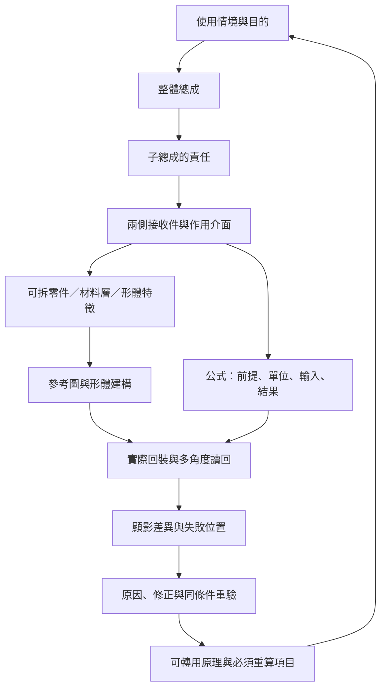

יהוה

# 以利亞修直神的道

**從用途到接面，從形體到公式，從參考到回裝；讓下一位製作者能找到依據、看見錯誤，並繼續改進。**

這是一套免費、開放的工程形體與組裝教材。以原創 GT01 車輛、內裝、輪端及工坊為實例，整理可轉用到家具、設備、電子產品、建築與自然形態展示的知識。專案展示名稱是「יהוה」，儲存庫名稱為 `YHWH-knowledge-tree`。

## 開始閱讀

下載 [最新完整離線教材包](https://github.com/usking08/YHWH-knowledge-tree/releases/latest)，解壓縮後開啟 `outputs/parts-library/knowledge-map.html`。網頁包含資料，可離線閱讀；立體教材採用隨附的 Three.js，無須付費服務。

- [知識樹閱讀與延伸方法](outputs/parts-library/KNOWLEDGE-GUIDE.md)
- [數學與現實規律教學](outputs/parts-library/MATH-TEACHING.md)
- [形體規律與組合方法](outputs/parts-library/SHAPE-THEORY.md)
- [從零件庫開始](outputs/parts-library/START-HERE.md)
- [來源、授權與參考圖讀法](THIRD_PARTY.md)
- [因果鏈與投稿方式](CONTRIBUTING.md)

大型參考圖、完整原生幾何與可旋轉網頁放在版本附件，保留相對路徑；儲存庫保存可閱讀的教學、原生建構來源與產生工具。離線包同時包含這些來源。不要只下載單一 HTML 而漏掉它旁邊的圖片及資料。

## 知識從哪裡長出來

每條路線都要回答：**作用在哪裡？為何需要這個形狀？接到誰？如何裝入與拆出？公式何時成立？畫面和原生資料為何不同？換到另一種物件要重算什麼？**

知識樹有二十一條機構分枝、六十四個跨域應用例，並接到四十七條既有形體與數學教材。這些數量用來描述索引範圍，不代表世界知識已列盡，也不代表整車、工坊或全部零件已通過驗收。

## 拆解的邊界

螺絲、墊圈、套筒、插銷、葉片、接收座逐件辨認。螺紋、凹穴、孔口、倒角與承壓面則屬零件特徵；材料層、可拆零件與連續母材分別記錄。不能把同一塊材料任意切碎後，稱為「已拆到底」。

每個末端節點必須說明為什麼在此停止：獨立成形材料、不可無損分離的材料層，或本版尚待進一步定義。`terminal` 欄位本身不是已無遺漏的證明。

## 參考圖與實體各自負責什麼

生成圖用於形狀、材料與組裝方向的視覺約束。尺寸只在有明列來源與定義時採用；不能由生成圖量測出虛假的加工精度。不同視圖矛盾時，保留退回原因及新版採用範圍。

例如鉸鏈教材保留筒孔被合併葉板侵入、盲孔從圓角邊穿出的實際問題，並記錄修法與回裝讀回。已取樣角度無交穿只證明列出的取樣；不能直接推成連續運動、公差、強度或耐久合格。

渲染粗糙度不等於加工粗糙度 Ra；陰影不是接觸量測；幾何對稱不等於動平衡；一個式子有解也不等於可製造。教材將它們分開，再用明確因果關係接回來。

## 目前版本

這是持續建造的教學版本。車輛分解登錄含 688 個節點；其中 228 個節點明列用途分枝，其餘仍由最近祖先提供閱讀脈絡。現有十二件獨立庫件各有直接用途分類；工坊資料仍保留只有材質名稱或空名稱而尚無足夠用途依據的物件。詳細範圍以離線包的 `knowledge-map.json` 與各模型讀回為準。

目前沒有宣稱整車完成、製造放行、所有參考圖無誤或所有用途已窮盡。未驗證項目與退回圖一起保存，供下一位製作者沿著明確位置繼續修正。

## 自由使用

本專案原創程式、教學、模型與可公開生成素材採 MIT 授權，允許使用、修改及再散布；請保留授權文字。Three.js 等第三方內容保留原授權。原廠文件擷取圖不隨包重發，以來源連結替代；不把第三方資料重新宣稱為本專案原創。
